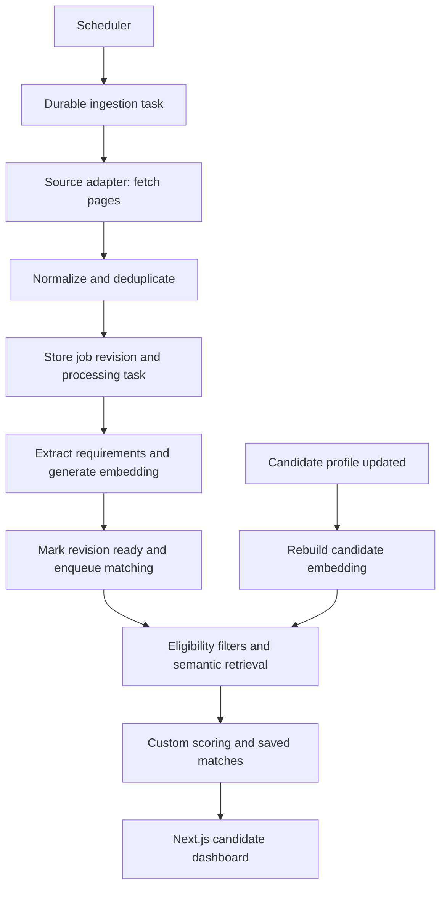

# India-first job ingestion and matching design

Design proposal, 11 September 2026. Runtime implementation is not included.

## Architecture

Keep Next.js + TypeScript, Drizzle, PostgreSQL/pgvector, and your embedding provider. Share server-side services between Route Handlers and a separately executed TypeScript worker. Start with software roles and a curated list of employers hiring in India; this is focused coverage, not the entire Indian job market.



Fetch and embed a job once per content revision, then reuse it across candidates. Workers call shared functions directly rather than calling your own embedding HTTP endpoint.

## Job sources

Implement one adapter first, then add adapters returning the same normalized shape.

| Source | Read endpoint | Discovery requirement |
| --- | --- | --- |
| Greenhouse | `https://boards-api.greenhouse.io/v1/boards/{board_token}/jobs?content=true` | Known employer board token |
| Lever | `https://api.lever.co/v0/postings/{site}?mode=json` | Known employer site; paginate using skip/limit |
| Ashby | `https://api.ashbyhq.com/posting-api/job-board/{board_name}` | Known employer board name; retain only listed postings |

These are company career-board APIs, not market-wide search engines. Maintain a source registry containing company identity, adapter, board identifier, enabled state, polling interval, cursor, and last successful complete sync. Begin with approximately 20–30 manually verified boards relevant to your target roles.

Official references: [Greenhouse Job Board API](https://docs.greenhouse.io/job-board.html), [Lever postings API](https://github.com/lever/postings-api), [Ashby public postings API](https://developers.ashbyhq.com/docs/public-job-posting-api). Public API availability alone does not establish permission for every downstream storage or redistribution use; check source conditions when onboarding.

For broader portal coverage, add a licensed feed adapter once access, India coverage, full-description availability, retention rights, and cost have been verified. Do not assume Naukri, LinkedIn, or Indeed offer unrestricted job-search APIs. Adzuna offers an authenticated search API, but India access and useful description coverage should be tested before choosing it: [API overview](https://developer.adzuna.com/overview).

## India normalization

- Represent country as `IN`; keep city, state, and original location text. Normalize Bangalore/Bengaluru and Gurgaon/Gurugram through explicit aliases. Treat Delhi NCR as a region containing distinct cities.
- Separate work arrangement (`remote`, `hybrid`, `onsite`, `unknown`) from allowed work countries. “Remote” alone does not mean an India-based candidate is eligible.
- Store original compensation text, currency, period, and basis (`base`, `ctc`, `unknown`). Convert explicit INR LPA to annual rupees: 12 LPA = 1,200,000 INR/year. Do not compare CTC with base salary as if equivalent. Preserve undisclosed values as null.
- Extract minimum/maximum experience, employment type, explicit notice-period limits, and mandatory versus preferred skills. Preserve evidence and unknown values. Experience outside a stated range is normally a penalty, unless a confirmed strict condition applies.
- Add candidate preferences for relocation, work arrangement, salary basis/minimum, notice period, and eligible countries. Do not infer eligibility from residence alone.
- Keep role/skill aliases explicit: SDE-1 may inform a role family but is not universally equivalent to a fixed seniority; React.js/React and NodeJs/Node.js can share canonical skill IDs.
- Store timestamps in UTC and display in Asia/Kolkata initially. Future markets use the same schema with different country, currency, and normalization configuration.

## Database changes

Extend the existing schema incrementally:

| Table | Main data and constraints |
| --- | --- |
| `job_sources` | Company identity, provider, board ID, enabled, schedule, cursor, last complete success |
| `jobs` | Canonical company/title, description, apply URL, normalized location/compensation, active status, current revision, first/last seen, published/closed timestamps |
| `job_source_listings` | Source ID + external ID unique, canonical job ID, source URL, permitted raw payload, content hash, first/last seen, source status |
| `job_revisions` | Job ID + revision unique, normalized content, extracted requirements, extraction version, processing status/error |
| `job_embeddings` | Job ID, revision, model/version, dimensions, template version, exact embedded text/hash, vector; unique on revision + embedding configuration |
| `candidate_embeddings` | Candidate profile revision and equivalent embedding metadata; either one current row updated atomically or explicitly versioned rows |
| `candidate_job_matches` | Candidate/job IDs, candidate/job revisions, scoring version, component scores, overall score, eligibility, missing facts, explanations, computed timestamp |
| `processing_tasks` | Task kind, payload, unique idempotency key, state, attempts, available time, lease expiry, error |
| `ingestion_runs` | Source, start/end, completion status, pages fetched, new/changed/skipped/failed counts |

Use a unique current match per candidate/job pair, updated only by a result for the intended current revisions. If retaining history, use a separate history table or a uniqueness key including both revisions and scoring version. APIs hide stale matches or label them pending refresh.

Same-source deduplication uses `(source_id, external_id)`. Across sources, prefer a shared employer requisition ID or canonical application URL. Company/title/location alone only identifies possible duplicates; it can collapse distinct openings. Preserve every source link when merging.

## Reliable ingestion

1. Scheduler inserts a task for each due source; do not create one fetch per candidate.
2. Worker claims tasks with a database lock and expiring lease. A PostgreSQL-backed queue keeps the initial infrastructure small. Use a maintained queue library after checking compatibility; custom queue code must implement leases, retry limits, and concurrency correctly.
3. Fetch bounded pages with timeouts, response-size limits, source-specific rate limits, and explicit HTTP status handling. Retry transient failures with exponential backoff/jitter and honor `Retry-After`. Record terminal failures for replay.
4. Parse and validate source data, convert HTML to plain text, normalize, and hash relevant content. Unchanged records update last-seen timestamps without another model call. Cheap metadata filters exclude clearly out-of-scope jobs; uncertain India eligibility is retained as unknown.
5. Commit the new revision and processing task together in a short database transaction. Call external models outside transactions. Treat descriptions as untrusted input, validate extraction with Zod, and bound input size.
6. Save extracted fields and a validated embedding, mark the revision ready, and create a match task atomically. Verify vector length, finite values, nonzero norm, and compatible model/configuration. An empty embedding is a failure, not success.
7. Retries reuse revision/configuration idempotency keys. A delayed worker must not overwrite a newer revision. Provider calls may still repeat if a process crashes before saving their output; bound attempts and monitor cost.
8. Mark a listing potentially closed only after a successful complete authoritative board sync. Confirm absence over two complete syncs as an initial policy. Never infer closure from a failed page, partial sync, or disappearance from search results. A canonical job stays active while an authoritative source still reports it active.

Run the worker as a supervised process/container; the scheduler only enqueues. If deployed entirely to serverless infrastructure, use a durable task runner instead of launching an unawaited loop from a Route Handler. The installed Next.js backend guide documents deployment-dependent execution limits in `node_modules/next/dist/docs/01-app/02-guides/backend-for-frontend.md`.

## Retrieval and scoring

Your existing `getSemanticScore` computes cosine similarity times 100. This is a ranking signal, not a probability of suitability or hiring success.

Use three steps:

1. **Eligibility:** reject confirmed incompatibilities with candidate non-negotiables, such as onsite work requiring relocation when the candidate explicitly refuses it. Missing facts yield `unknown`, not rejection. Skill/experience mismatches normally affect score.
2. **Retrieve:** for a small initial database, score all eligible active jobs. As volume grows, retrieve a configurable top-K by vector distance within compatible embedding versions, then rerank. Start experiments around K=200; measure relevant-job recall before settling on K. Consider a union of semantic and role/skill retrieval so exact matches are not missed.
3. **Rerank:** reuse your deterministic custom logic and return component scores plus evidence. An initial experimental weighting is semantic 35%, required skills 35%, experience 15%, role preference 10%, preferred skills 5%. These weights are hypotheses requiring evaluation.

For an initial semantic component only, clamp cosine similarity to [0,1]. Required-skill coverage is matched mandatory skills / known mandatory skills using canonical aliases. No extracted mandatory skills makes this component unavailable, not 100%. Score explicit experience shortfalls proportionally; missing experience requirements remain unavailable. Define role/preferred-skill components using explicit mappings and coverage.

Compute `100 * sum(weight * availableComponent) / sum(availableWeight)` and separately expose evidence coverage (`sum(availableWeight) / sum(allWeight)`). Low coverage or unresolved mandatory eligibility produces `needs_review`, even if the numerical score is high. A hard eligibility failure produces `not_eligible` regardless of score. Do not represent the score as a match probability.

Use `fitScore: 78`, `eligibility: eligible | not_eligible | unknown`, `relevance: relevant | not_relevant | needs_review`, component scores, missing skills, and evidence. Determine relevance cutoffs from labeled examples; a demo threshold such as 70 is provisional, not a validated production decision. Keep freshness separate from fit and use it as a secondary sort.

Use aligned job/candidate embedding templates with role, skills, responsibilities or project/work evidence, and experience. Persist the exact text sent to the API. Keep name/email out of the matching text. Rebuild both sides when changing embedding configurations; do not compare incompatible models even if dimensions match.

For candidate updates, replace/rebuild the candidate embedding and rematch existing jobs. For job updates, rematch against candidates; at small scale all candidates are reasonable. At larger scale, use candidate retrieval plus explicit invalidation/rescoring of existing matches so old matches cannot remain current accidentally. Add pgvector indexing only after verifying support for your vector dimension, operator, and filtered-query recall.

## Mapping to this repository

Proposed additions under the current layout:

```text
app/src/lib/sources/{types,greenhouse,lever,ashby}.ts
app/src/lib/ingestion/{normalize,deduplicate,ingest}.ts
app/src/lib/matching/{eligibility,retrieve,score,save}.ts
app/src/lib/tasks/{enqueue,handlers}.ts
app/scripts/worker.ts
app/api/internal/ingestion/route.ts
app/api/me/matches/route.ts
```

Extract the model prompt and analysis call from `app/api/analyze-job/route.ts` into a shared analysis service; retain the route as a manual-import entry point using the same pipeline. Stop selecting the first candidate from the entire table. Candidate-facing routes resolve an authenticated candidate and enforce ownership; ingestion triggers require scheduler/admin authentication. Return a task ID with HTTP 202 only after the task is durably committed. The matches endpoint reads saved results with pagination and status filters.

Current issues to resolve during implementation:

- The analysis route embeds extracted JSON but stores the raw description as embedding `content`; these should reflect the same actual input.
- Analysis includes responsibilities/preferred skills, but the jobs insert discards them.
- Job embeddings allow duplicate rows, and matching chooses an arbitrary first row without revision selection.
- Job creation, embedding creation, and scoring are coupled in one request; failures leave partial state without a retry workflow.
- `generateEmbedding` returns an empty array on missing output; matching also needs explicit handling for null vectors.
- There is no persisted per-candidate match, source identity, job lifecycle, or ingestion state.

## Implementation sequence and verification

1. Add source identity, lifecycle/revisions, durable tasks, and one Greenhouse adapter. Verify one configured employer actually has in-scope listings before expanding the registry.
2. Refactor existing analysis/embedding code into retryable services; validate exact embedding input and configuration metadata.
3. Add candidate-specific eligibility, custom scoring, saved matches, and an authenticated read endpoint. Keep manual import useful for coverage gaps.
4. Add scheduled polling, closure handling, Lever/Ashby adapters, and a dashboard with score explanations, unknown facts, posted/last-checked dates, and original apply links.
5. Label approximately 100–200 candidate/job pairs across India locations, experience levels, and work arrangements. Measure precision@10, retrieval recall, and false exclusions; tune weights and relevance thresholds. Track ingestion latency, stale-job rate, task failures, and model calls/cost per new or changed job.

Meaningful integration checks: importing the same source item twice creates one listing/revision/embedding; changed content creates a new revision; a crash after persistence resumes; stale workers cannot replace newer results; partial sync does not close jobs; unknown remote eligibility requires review; a candidate update invalidates prior scores; one candidate cannot read another candidate's matches.
